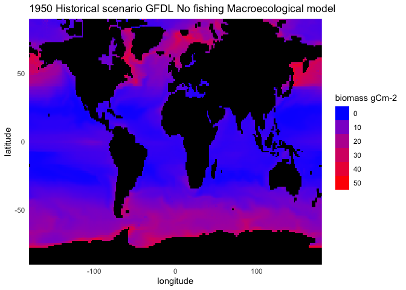
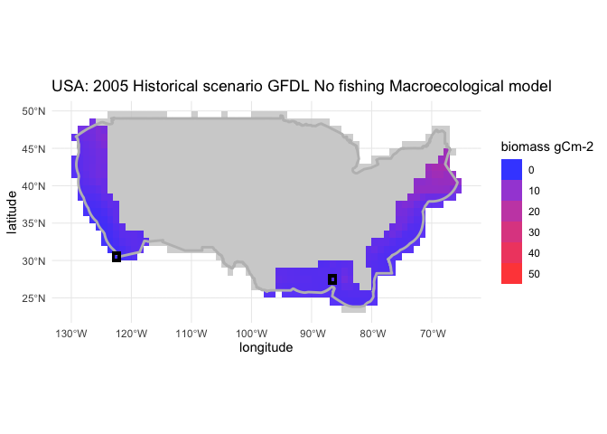
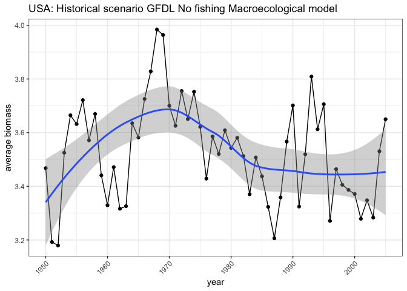

test_US
================
2023-01-12

### Load model historical data

``` r
# method on how to read netcdf files: https://pjbartlein.github.io/REarthSysSci/netCDF.html

# Load data
macro_tcb <- nc_open(here("data/macroecological_gfdl-esm2m_nobc_historical_wo-diaz_no-fishing_no-oa_tcb_global_annual_1950_2005.nc4"))

lat <- ncvar_get(macro_tcb, "lat")
lon <- ncvar_get(macro_tcb, "lon")
time <- ncvar_get(macro_tcb, "time") + 1661
tunits <- ncatt_get(macro_tcb, "time", "units")

dname <- "tcb"
var_array <- ncvar_get(macro_tcb, dname)

var_brick <- raster::brick(aperm(var_array, c(2,1,3)), xmn=-180, xmx = 180, ymn=-90, ymx=90)
names(var_brick) <- as.factor(time)
```

### Map of model prediction in 1950

``` r
gplot(var_brick$`X1950`) + geom_tile(aes(fill = value)) +
  theme_minimal() + ylab("latitude") + xlab("longitude") +
  guides(fill=guide_legend(title="biomass gCm-2")) +
  scale_fill_gradient(low = "blue", high = "red", na.value = "black", limits = c(0,50)) +
  ggtitle("1950 Historical scenario GFDL No fishing Macroecological model") +
  scale_x_continuous(limits = c(-180,180), expand = c(0,0)) +
  scale_y_continuous(limits = c(-90,90), expand = c(0,0)) 
```

<!-- -->

### Extract data for the US with EEZs shapefile

``` r
# load EEZs
eez_us <- st_read(here("data/EEZ_land_union_v3_202003/EEZ_Land_v3_202030.shp"))[113,]
```

    ## Reading layer `EEZ_Land_v3_202030' from data source 
    ##   `/Users/auroremaureaud/Documents/Rutgers University/Minerva/resource_synthesis/data/EEZ_land_union_v3_202003/EEZ_Land_v3_202030.shp' 
    ##   using driver `ESRI Shapefile'
    ## Simple feature collection with 323 features and 30 fields
    ## Geometry type: MULTIPOLYGON
    ## Dimension:     XY
    ## Bounding box:  xmin: -180 ymin: -90 xmax: 180 ymax: 86.99401
    ## Geodetic CRS:  WGS 84

``` r
# extract grid cells in polygon
crs(var_brick) <- st_crs(eez_us)
var_extract <- data.frame(exact_extract(var_brick, eez_us, include_xy=TRUE)[[1]])
names(var_extract)[1:length(time)] <- time
var_extract <- var_extract %>% 
  pivot_longer(1:length(time), names_to = "year", values_to = "biomass") %>% 
  mutate(year = as.numeric(year))

ggplot(eez_us) + geom_sf() + 
  geom_tile(data = var_extract[var_extract$year==2005,], aes(x, y, fill = biomass), 
            alpha = 0.8) +
  scale_fill_gradient(low = "blue", high = "red", na.value = "grey80", limits = c(0,50)) +
  geom_sf(data = eez_us, linewidth = 1, fill = NA, color = "grey") +
  guides(fill=guide_legend(title="biomass gCm-2")) +
  theme_minimal() + ylab("latitude") + xlab("longitude") +
  ggtitle("USA: 2005 Historical scenario GFDL No fishing Macroecological model") +
  geom_tile(data = var_extract[var_extract$x == -122.5 & var_extract$y==30.5,], aes(x,y), fill = NA,
            color = "black", linewidth = 1) +
  geom_tile(data = var_extract[var_extract$x == -86.5 & var_extract$y==27.5,], aes(x,y), fill = NA,
            color = "black", linewidth = 1)
```

<!-- -->

### Smoothing temporal trend in two grid cells

``` r
cell_1 <- var_extract %>% 
  filter(x == -122.5,
         y == 30.5) %>% 
  ggplot(aes(x = year, y = biomass)) + geom_point() + geom_path() +
  theme_bw() +
  theme(axis.text.x = element_text(angle = 45, hjust = 1)) +
  geom_smooth(method = loess, span = 0.5)+
  ggtitle("-122.5; 30.5")

cell_2 <- var_extract %>% 
  filter(x == -86.5,
         y == 27.5) %>% 
  ggplot(aes(x = year, y = biomass)) + geom_point() + geom_path() +
  theme_bw() +
  theme(axis.text.x = element_text(angle = 45, hjust = 1)) +
  geom_smooth(method = loess, span = 0.5)+
  ggtitle("-86.5; 27.5")

grid.arrange(cell_1, cell_2, ncol = 2)
```

<!-- -->

### Smoothing average biomass temporal trend

``` r
var_extract %>% 
  filter(!is.na(biomass)) %>% 
  group_by(year) %>% 
  summarize(biomass = mean(biomass)) %>% 
  ggplot(aes(x = year, y = biomass)) + geom_point() + geom_path() +
  theme_bw() +
  theme(axis.text.x = element_text(angle = 45, hjust = 1)) +
  geom_smooth(method = loess, span = 0.5)+
  ggtitle("USA: Historical scenario GFDL No fishing Macroecological model") +
  ylab("average biomass")
```

<!-- -->
